# Laravel E-Shop

# Developer Name : Mohammed Souliman    
## Contact Me : mohammed.souliman1999@gmail.com


  
  

<p align="center">
    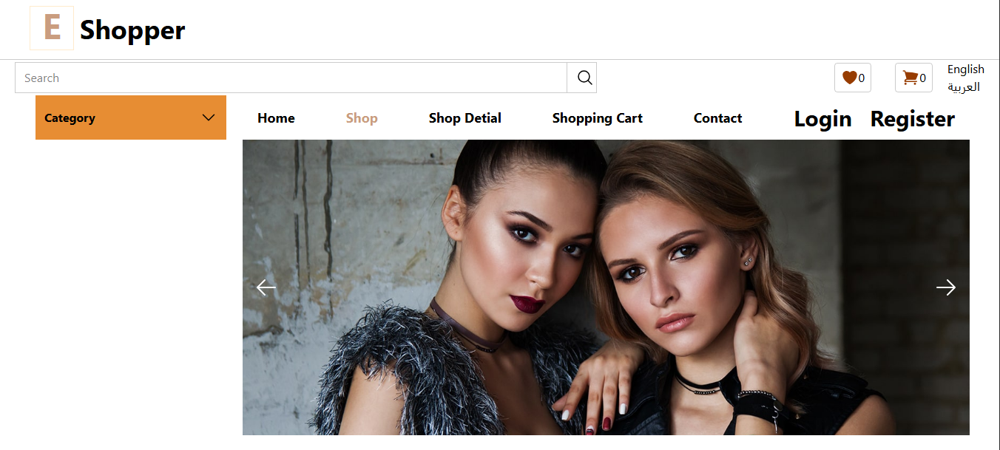
    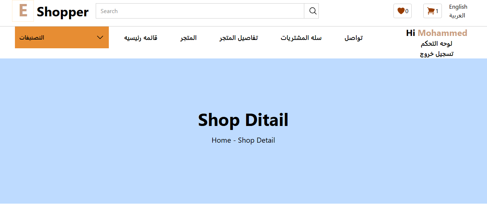
</p>
## 📋 الوصف
مشروع متجر إلكتروني باستخدام Laravel و tialwind. يتيح إدارة المنتجات، عرضها، , اضافتها الي السله و تصفيه المنتجات وعملية الشراء من المستخدمين و ادارة حسابات المستخدمين.

##🚀 الميزات
- لوحه تسجيل دخول للمستخدمين (Authentication )  
- عرض المنتجات + تفاصيلها
- تصفيه المنتجات بحسب ( السعر و المجمواعة )
- إضافة المنتجات إلى سلة الشراء
- لوحة تحكم للإدارة ((REST API) CRUD للمنتجات), (admin panel)
- رفع صور المنتجات
- يتضمن اللغه العربيه و الانكليزيه translatable page
- شكل واجهة مستخدم بسيط و متجاوب
- إعدادات الدفع (لايوجد حاليا)  
- صلاحيات الإدارة / المستخدم

## screenShots

 <p>
      
  
  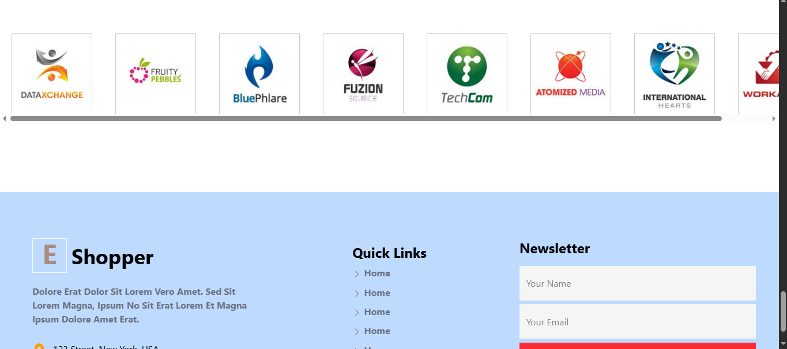
   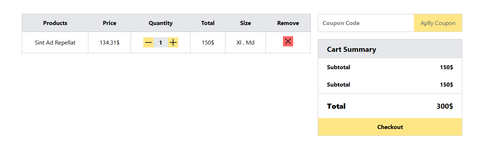
   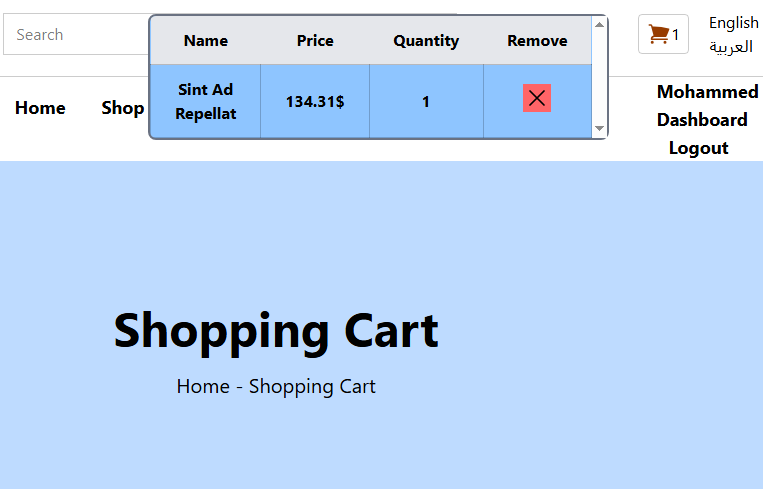
   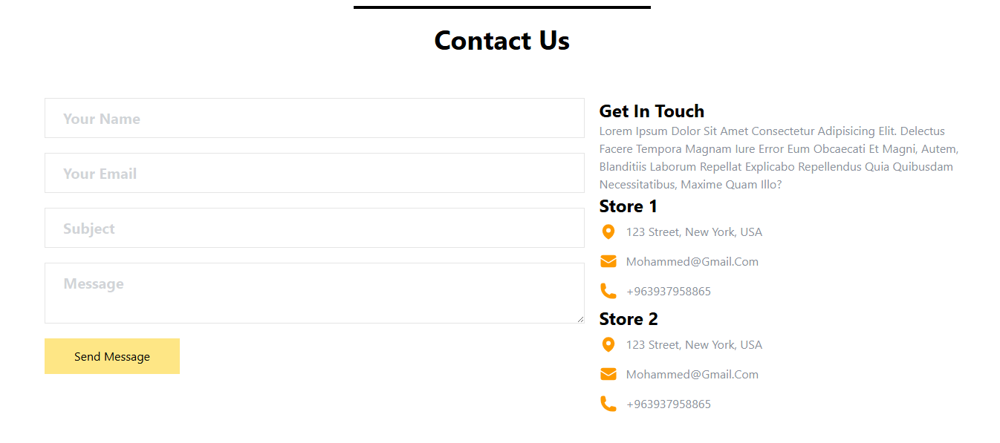
  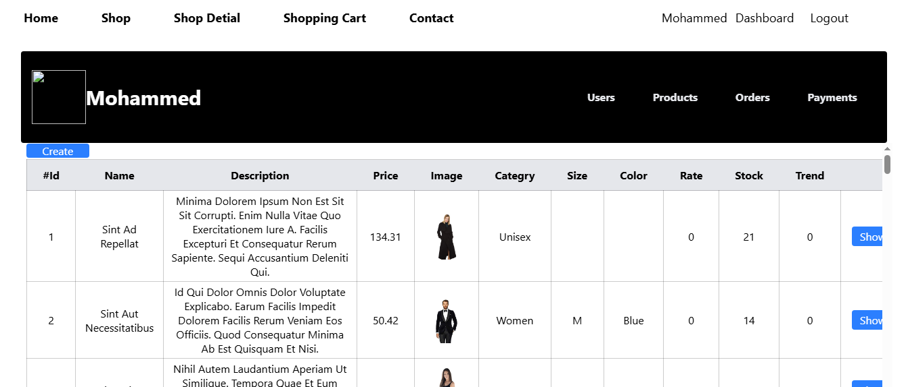
   
  
  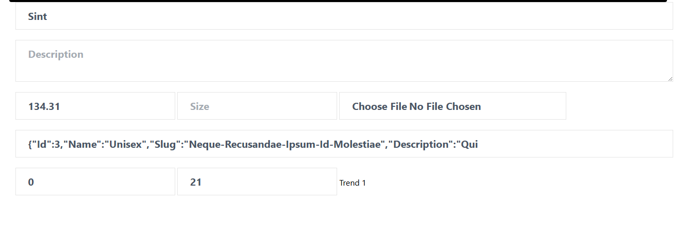
  
 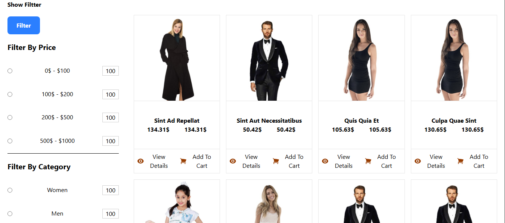
   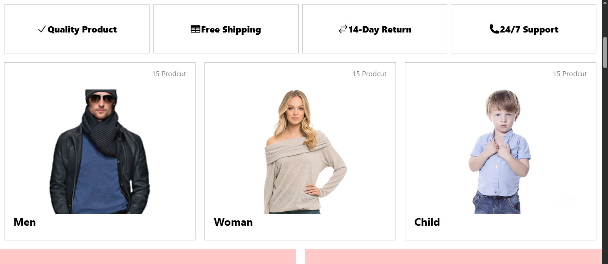
   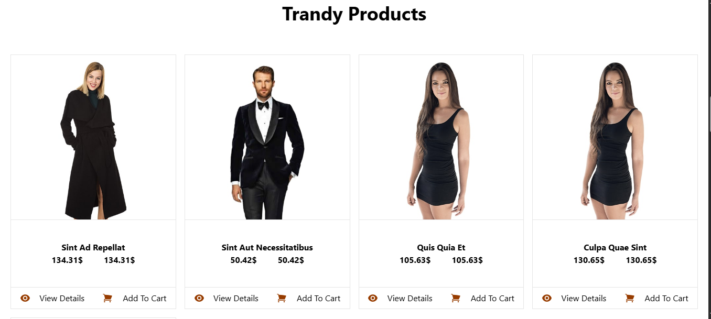
   
  
  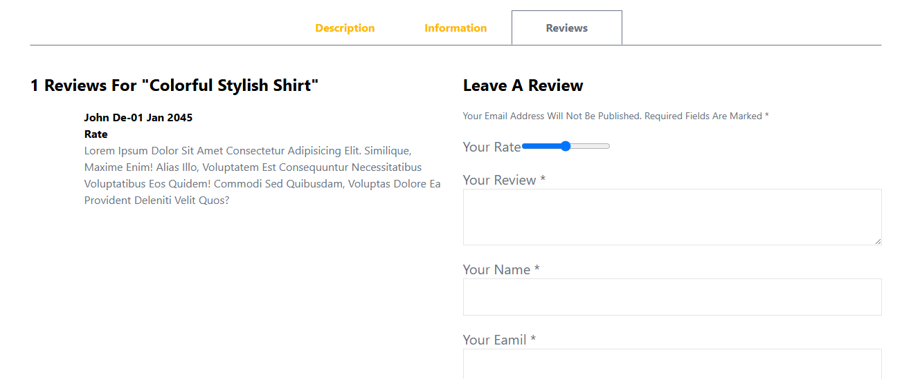
 </p>


 
## 🛠 التقنيات المستخدمة
- Laravel 12
- قاعدة البيانات: MySQL   
- واجهة: Blade + Tailwind  
- حزم إضافية: (mcamara for translate pages , laravel breeze for auth) 

## 🧪 التثبيت محلياً
```bash
git clone https://github.com/MohammedSouliman98/Laravel_E_Shop.git
cd Laravel_E_Shop

Create Database e_shop


npm install
npm run build


composer install
cp .env.example .env
php artisan key:generate

php artisan migrate
php artisan db:seed  

php artisan serve --host=127.0.0.1 --port=8000

لاعادة توليد بيانات في قواعد البيانات
php artisan migrate:fresh --seed


information for login with admin

Email : mohammed@mohammed.com
password : 12121212


